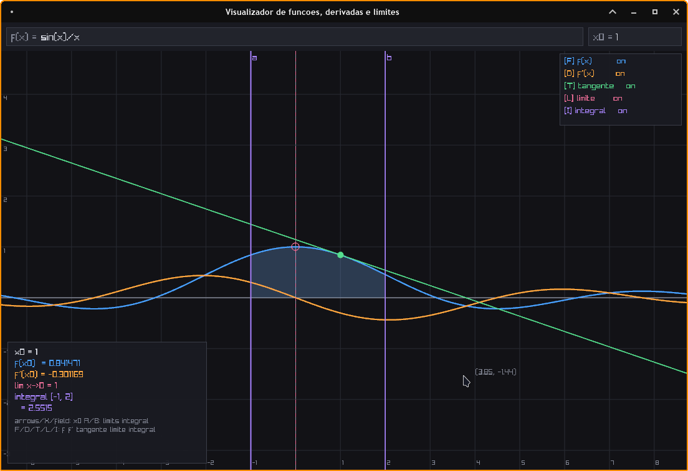

# Math Visualizer

A graphing calculator that receives a function and displays its graph, as well as calculating the derivative at the point x chosen by the user, the limit as x approaches the origin, and the integral.



## Prerequisites
Arch Linux
```bash
sudo pacman -S raylib
```
Debian/Ubuntu-based systems
```bash
sudo apt install libraylib-dev
```

macOS (via Homebrew)
```
brew install raylib
```

##Requirements

  1 -  Compiler: A C99-compliant compiler (e.g., gcc, clang).

  2 -  Build Tool: make

## How Build and Run

```bash
git clone https://github.com/Senka07/math_visualizer.git && cd math_visualizer
make
./grafico
```

## License

GPL-3.0
